<h1 align="center">Hi, I'm Nestor Guzman 👋</h1>

  <b>AI &amp; Automation Engineer</b> · Full-Stack Developer 
  I build autonomous agents, RPA pipelines, and production web &amp; mobile systems.

---

### 🚀 What I'm working on

- **AI agents & LLM tooling** — autonomous agents, Claude Code skills, and retrieval-backed assistants that turn messy workflows into reliable automation.
- **RPA & device automation** — driving Android apps and browsers headlessly (Puppeteer + CDP), plus messaging bots that run unattended in production.
- **Full-stack products** — urban-transit and dashboard apps end to end: NestJS/Python backends, Angular/Ionic clients, PostgreSQL + pgvector, shipped on Docker with CI/CD.

With 6+ years across the stack, I like the seam where **software meets automation** — the boring, repetitive work a machine should be doing instead of a person.

### 🛠️ Tech stack

**Backend**

**Frontend & Mobile**

**AI & Automation**

**Data & DevOps**

### 📊 GitHub in numbers

### 📌 Featured projects

- **[claude-brain-skill](https://github.com/sunshine772/claude-brain-skill)** — a Claude Code skill that installs an interconnected markdown knowledge base (an "LLM wiki") into any project.
- **[Pop](https://github.com/sunshine772/Boxels-Pop-Web)** — kanban-style task manager: an Angular 17 + PrimeNG client backed by a [Python + PostgreSQL server](https://github.com/sunshine772/Boxels-Pop-Server).

*More automation and AI work lives in private client repos — happy to walk through it.*

### 📫 Connect

Open to remote opportunities in full-stack development and AI/automation engineering.
